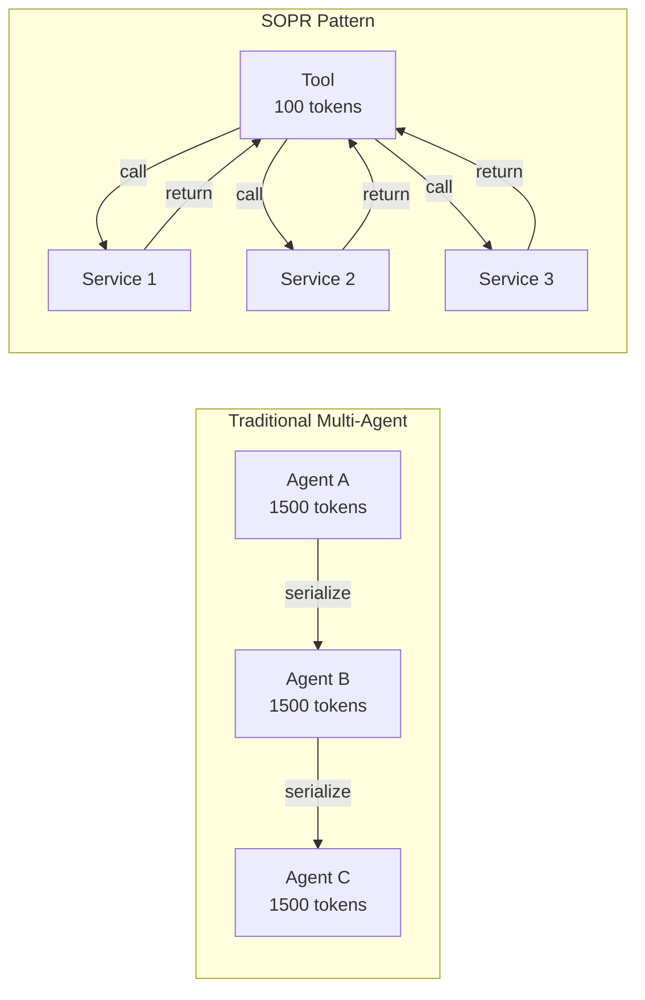
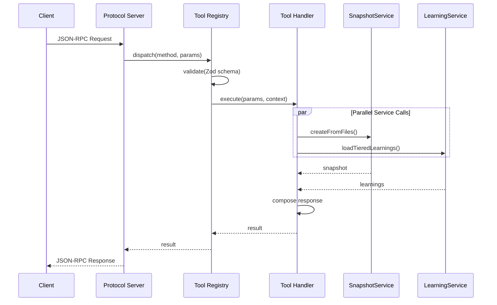
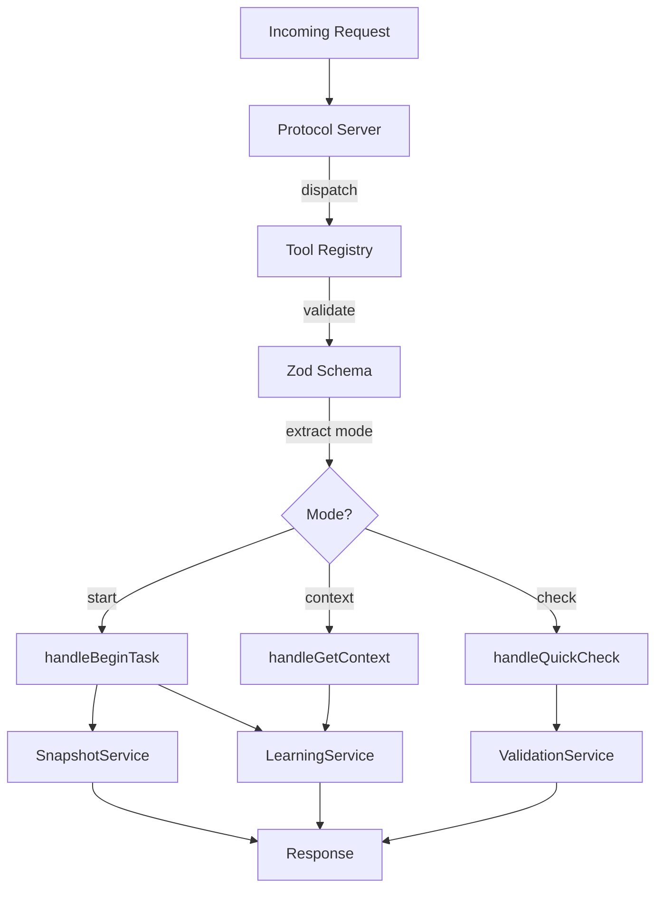
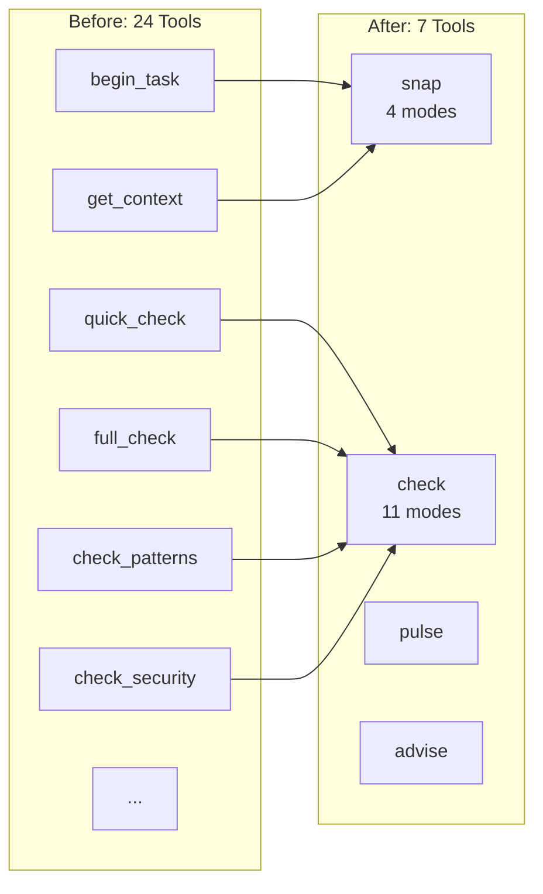
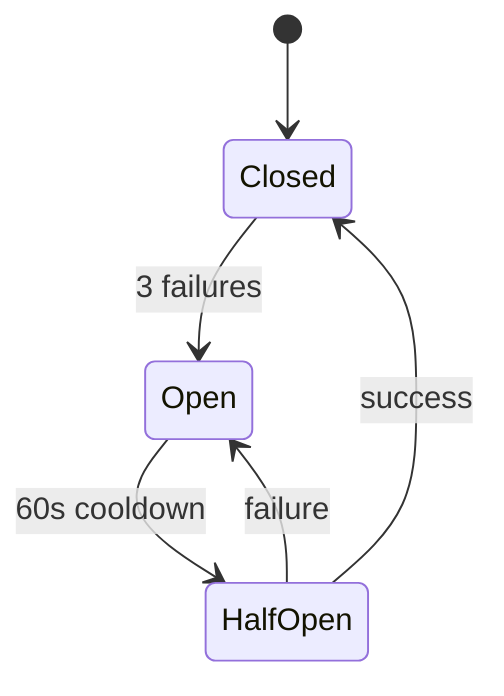
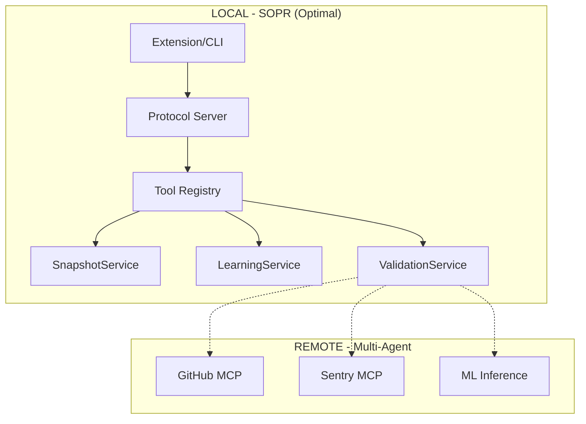
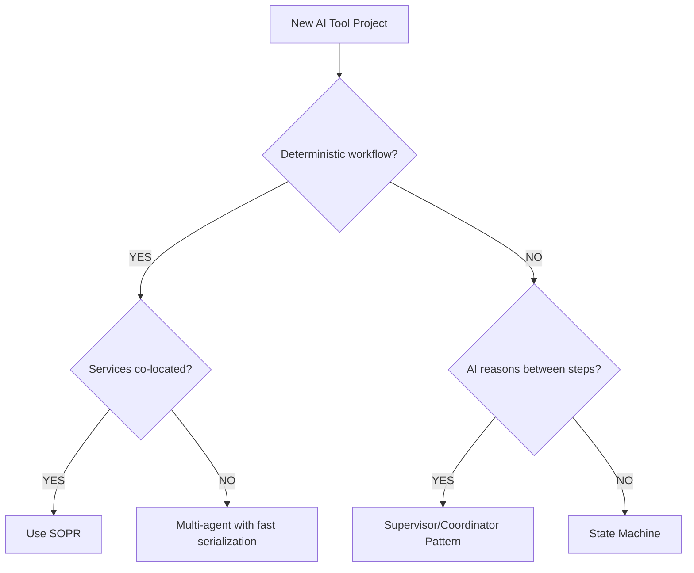

# SOPR Diagrams

Mermaid diagrams for the Service-Oriented Protocol Router pattern. These can be rendered in GitHub, VS Code, or any Mermaid-compatible viewer.

## Architecture Comparison

### Multi-Agent vs SOPR

## Request Flow

## Mode-Based Dispatch

## Tool Consolidation

## Circuit Breaker State Machine

## Deployment Topology

## Decision Framework

